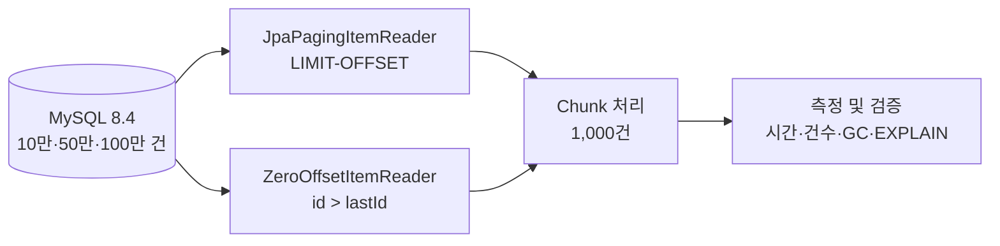

# Settlement Batch Performance

> 대량 정산 배치에서 `LIMIT-OFFSET`은 왜 느려질까?  
> Spring Data JPA만으로 Zero Offset Reader를 직접 구현하고, 10만·50만·100만 건에서 그 차이를 검증합니다.

## 프로젝트 한눈에 보기

대량 데이터를 페이지 단위로 읽는 `JpaPagingItemReader`는 뒤 페이지로 갈수록 큰 OFFSET을 사용합니다. DB는 앞선 행을 탐색한 후 버려야 하므로 데이터가 많아질수록 조회 비용이 증가할 수 있습니다.

이 프로젝트는 외부 Zero Offset 라이브러리에 의존하지 않고 다음 쿼리를 사용하는 Reader를 직접 구현하여 기존 방식과 비교합니다.

```sql
SELECT *
FROM settlement
WHERE id > :lastId
ORDER BY id ASC
LIMIT :pageSize;
```

핵심은 “Zero Offset이 빠르다”는 결론을 미리 정하는 것이 아닙니다. 동일한 데이터·조회 조건·실행 환경에서 반복 측정하고, 정합성·실행 계획·메모리 사용량까지 함께 확인하는 것이 목표입니다.

## 문제 정의

일반적인 Offset Pagination은 구현이 단순하지만 페이지가 뒤로 갈수록 다음과 같은 비용이 발생합니다.

```sql
SELECT *
FROM settlement
ORDER BY id ASC
LIMIT 1000 OFFSET 500000;
```

MySQL은 OFFSET 이전의 행을 결과에서 제외하더라도 조회 과정에서는 탐색해야 합니다. 반면 Zero Offset, 즉 Keyset Pagination은 마지막으로 읽은 PK를 다음 조회 시작점으로 사용합니다.

```text
OFFSET 방식
페이지 번호 → 앞선 행 탐색 → OFFSET만큼 버림 → 1,000건 반환

Zero Offset 방식
마지막 ID → PK 인덱스에서 시작점 탐색 → 다음 1,000건 반환
```

## 기술적 선택

| 대안 | 장점 | 단점 | 판단 |
| --- | --- | --- | --- |
| `JpaPagingItemReader` | Spring Batch 기본 제공, 구현이 단순함 | 큰 OFFSET에서 비용 증가 가능 | 비교 기준으로 사용 |
| 직접 구현한 Zero Offset Reader | OFFSET 제거, JPA 학습 범위 안에서 구현 가능 | 상태와 재시작 지점을 직접 관리해야 함 | 핵심 구현 |
| `JdbcCursorItemReader` | Native SQL과 스트리밍 활용 가능 | JPA 기반 비교라는 학습 목표에서 벗어남 | MVP 제외 |
| `JpaCursorItemReader` | 설정이 간단함 | 메모리 특성을 별도로 검증해야 함 | 선택 실험 |
| QueryDSL/외부 Reader | 편리하고 타입 안전함 | 핵심 원리를 라이브러리가 감춤 | 사용하지 않음 |

Zero Offset Reader는 다음 불변 조건을 지키도록 설계합니다.

- 유일하고 불변인 증가 PK `id`를 정렬 기준으로 사용
- `WHERE id > :lastId ORDER BY id ASC` 보장
- 정상 처리한 페이지의 마지막 ID만 다음 시작점으로 갱신
- 재시작 시 `ExecutionContext`에서 `lastId` 복원
- 전체 처리 건수와 ID를 검증하여 누락·중복 방지

## 전체 구조



Spring Batch의 처리 단위는 다음과 같습니다.

```text
Job
└── Step
    ├── ItemReader    ← 이 프로젝트의 핵심 비교 대상
    ├── ItemProcessor
    └── ItemWriter
         └── 1,000건마다 commit
```

## 실험 설계

### 통제 조건

| 항목 | 기본값 |
| --- | --- |
| 데이터 규모 | 100,000 / 500,000 / 1,000,000건 |
| Chunk size | 1,000 |
| Page size | 1,000 |
| Fetch size | 1,000 |
| DB | Docker MySQL 8.4 |
| 정렬 | `id ASC` |
| 반복 횟수 | 조건별 3회 이상 |
| 비교 원칙 | 동일 WHERE 조건·반환 컬럼·Writer 사용 |

각 실험은 워밍업과 측정 실행을 구분하고, 실행 순서를 기록합니다. DB 버퍼 풀·OS 캐시·JIT 등 완전히 제거하기 어려운 변수는 결과의 한계로 명시합니다.

### 측정 지표

- Job/Step 실행 시간과 Reader별 상대 비율
- `readCount`, `writeCount`, `skipCount`, `rollbackCount`
- 데이터 증가 배율 대비 실행 시간 증가 배율
- 구간별 또는 페이지별 조회 시간
- GC 횟수, 정지 시간, 최대 힙 및 Old Gen 사용량
- 보조 인덱스 ON/OFF에 따른 `EXPLAIN ANALYZE` 결과
- 입력 건수와 최종 처리 건수의 일치 여부

### 인덱스 실험 원칙

`id`가 PK라면 PK 인덱스를 제거하는 비현실적인 실험은 하지 않습니다. 기본 Zero Offset 실험은 PK 인덱스가 있는 상태에서 수행하고, 인덱스 ON/OFF 비교는 실제 조회 조건에 사용되는 `status`, `merchant_id`, `settled_at` 등의 보조·복합 인덱스를 대상으로 합니다.

### 원문 참고 수치와 자체 실측값 구분

프로젝트를 시작하게 된 원문 사례와 이 저장소에서 직접 측정한 결과는 서로 다른 증거입니다.

| 구분 | 수치 | 이 프로젝트에서 재현했는가? | 사용 원칙 |
| --- | --- | --- | --- |
| 출처의 참고 수치 | 하루 1억 건 처리 사례 | 아니요 | 문제 배경으로만 사용 |
| 출처의 참고 수치 | offset 5천만 구간의 지연 | 아니요 | 문제 배경으로만 사용 |
| 출처의 참고 수치 | 300만 건 기준 6,752초 대 266초 | 아니요 | 자체 결과나 예상값으로 사용하지 않음 |
| 이 프로젝트의 실측값 | 10만·50만·100만 건 Reader별 3회 측정 | 예 | 실행 환경·원본 로그와 함께 결과로 사용 |

따라서 아래 성능 결과의 숫자는 원문 수치를 환산하거나 추정한 값이 아니라 이 저장소의 코드와 로컬 MySQL로 직접 실행한 값입니다.

## 성능 결과

2026-08-13에 실행한 `20260813-100k-baseline-02`의 실측 결과입니다. 표의 시간은 워밍업을 제외한 Step 실행 시간이며 단위는 ms입니다. 실행 순서는 1회차 Paging→Zero Offset, 2회차 Zero Offset→Paging, 3회차 Paging→Zero Offset으로 교차했습니다.

| 데이터 건수 | Reader | 1회차 | 2회차 | 3회차 | 평균 | 중앙값 | Paging 대비 |
| ---: | --- | ---: | ---: | ---: | ---: | ---: | ---: |
| 100,000 | JpaPaging | 1,418.181 | 1,324.990 | 1,555.820 | 1,432.997 | 1,418.181 | 100.0% |
| 100,000 | Zero Offset | 886.788 | 857.492 | 851.566 | 865.282 | 857.492 | 60.4% |
| 500,000 | JpaPaging | 18,766.024 | 18,636.937 | 18,163.810 | 18,522.257 | 18,636.937 | 100.0% |
| 500,000 | Zero Offset | 4,228.155 | 4,205.353 | 4,164.991 | 4,199.500 | 4,205.353 | 22.7% |
| 1,000,000 | JpaPaging | 124,191.909 | 129,580.721 | 123,945.169 | 125,905.933 | 124,191.909 | 100.0% |
| 1,000,000 | Zero Offset | 10,306.721 | 8,788.994 | 8,321.469 | 9,139.061 | 8,788.994 | 7.3% |

Zero Offset의 평균 Step 시간은 Paging 대비 10만 건에서 60.4%, 50만 건에서 22.7%, 100만 건에서 7.3%로 측정됐습니다. 10만 건 대비 데이터가 5배일 때 Paging 시간은 12.93배, Zero Offset은 4.85배였고, 데이터가 10배일 때 Paging은 87.86배, Zero Offset은 10.56배였습니다. 이번 환경에서는 데이터가 커질수록 Paging의 증가 폭이 더 컸습니다.

페이지별 조회 시간을 측정 3회 평균으로 비교하면 Paging은 뒤 페이지로 갈수록 증가했고, Zero Offset은 비슷한 수준을 유지했습니다. 각 데이터셋의 마지막 페이지 다음에 실행되는 종료 확인용 빈 조회는 추세 집계에서 제외했습니다.

| 데이터 | Reader | 초반 10 page | 중반 10 page | 후반 10 page | 후반/초반 |
| ---: | --- | ---: | ---: | ---: | ---: |
| 100,000 | JpaPaging | 7.295ms | 9.460ms | 13.889ms | 1.90배 |
| 100,000 | Zero Offset | 4.783ms | 4.646ms | 4.804ms | 1.00배 |
| 500,000 | JpaPaging | 5.659ms | 31.605ms | 55.416ms | 9.79배 |
| 500,000 | Zero Offset | 5.123ms | 4.579ms | 4.597ms | 0.90배 |
| 1,000,000 | JpaPaging | 6.630ms | 59.865ms | 367.600ms | 55.45배 |
| 1,000,000 | Zero Offset | 5.988ms | 5.199ms | 4.977ms | 0.83배 |

따라서 이번 환경의 10만·50만·100만 건 결과는 Paging의 후반 페이지 비용 증가, Zero Offset의 비교적 일정한 페이지 시간, 데이터 규모 증가에 따른 두 방식의 다른 증가 양상이라는 가설 1·2·3과 일치했습니다.

- [실행별 설명과 파일 목록](./results/20260813-100k-baseline-02/README.md)
- [원본 지표 로그](./results/20260813-100k-baseline-02/metrics.log)
- [환경 기록](./results/20260813-100k-baseline-02/environment.txt)
- [수식 기반 요약표와 페이지 추세 차트](./results/20260813-100k-baseline-02/benchmark-report.xlsx)
- [50만 건 원본 지표 로그](./results/20260813-500k-baseline-01/metrics.log)
- [100만 건 최종 원본 지표 로그](./results/20260813-1m-baseline-02/metrics.log)
- [10만·50만·100만 통합 결과표](./results/20260813-scaling-comparison/benchmark-comparison.xlsx)

### 집계 방식과 원본 결과

최종 집계 대상은 `20260813-100k-baseline-02`, `20260813-500k-baseline-01`, `20260813-1m-baseline-02`의 `metrics.log`에서 `phase=MEASURED`인 실행입니다. 데이터 규모와 Reader마다 3개 값을 다음 방식으로 계산했습니다.

- 개별값: `stepDurationNanos ÷ 1,000,000`으로 변환한 Step 실행 시간(ms)
- 평균: Reader별 3개 Step 실행 시간의 산술평균
- 중앙값: Reader별 3개 값을 크기순으로 정렬했을 때 가운데 값
- Paging 대비 비율: `Zero Offset 평균 ÷ JpaPaging 평균 × 100`
- 페이지 구간 평균: 측정 3회의 해당 page 조회 시간을 모두 합쳐 평균
- 제외 페이지: 데이터를 반환하지 않고 종료만 확인하는 각 실행의 마지막 빈 page

요약 스프레드시트의 평균·중앙값·페이지 구간값은 원본 시트 참조 수식으로 계산해 수동 복사 과정의 오류를 줄였습니다. 전체 애플리케이션 로그는 `raw/benchmark.log`, 데이터 생성 검증은 `raw/dataset-verification.log`에서 확인할 수 있습니다.

### 실패·이상치와 기대가 다른 결과 기록

- 최종 3개 실행 ID의 워밍업 6회와 측정 18회는 모두 성공했습니다.
- 각 실행은 데이터셋 크기와 `readCount`·`writeCount`가 일치했고 `skipCount=0`, `rollbackCount=0`이었습니다.
- 최종 측정값과 페이지별 일시적 상승 구간은 임의로 제외하지 않았습니다.
- 예비 실행 `20260813-100k-baseline-01`은 Java 26에서 실행됐고 페이지 로그에 실행 회차 식별자가 없어 최종 집계에서 제외했습니다. 제외 이유와 원본 로그는 해당 결과 디렉터리에 그대로 보존했습니다.
- 첫 100만 건 실행 `20260813-1m-baseline-01`의 Paging 2회차는 Step 시간 511,195.758ms와 단조 시계 시간 118,807.568ms가 392,388.190ms 차이 났습니다. 실행 중 시스템 시각 보정이 Step 시작·종료 시각 계산에 들어간 것으로 판단해 원본과 이유를 보존하고 전체 세트를 `baseline-02`로 다시 측정했습니다.
- 이번 결과는 가설 1·2·3과 일치했습니다. 이후 결과가 가설과 다르면 삭제하거나 기대값으로 바꾸지 않고 같은 방식으로 실패·환경·원본 로그를 남깁니다.

## 실험 환경과 한계

최종 세 데이터셋은 같은 머신, Java, Docker MySQL 조건에서 측정했습니다. 다른 환경에서 재현할 때는 각 결과 디렉터리의 `environment.txt`와 비교합니다.

| 항목 | 최종 실행 공통 환경 |
| --- | --- |
| OS | macOS Darwin 25.5.0, arm64 |
| CPU / 메모리 | Apple M5 10 logical CPU / 16GiB |
| Java | Java 21.0.7 LTS |
| DB | Docker MySQL 8.4.10 |
| 애플리케이션 | Spring Boot 4.1.0 / Gradle 9.5.1 |
| 실행 형태 | 단일 머신, 한 JVM에서 워밍업과 측정 순차 실행 |

이 결과에는 다음 한계가 있습니다.

- 단일 로컬 머신의 한 세션에서 측정했으므로 다른 장비와 운영 환경의 절대 시간을 대표하지 않습니다.
- DB 버퍼 풀과 OS 파일 캐시를 실행마다 비우지 않았습니다.
- JVM JIT 컴파일과 GC 영향을 완전히 분리하지 못했습니다.
- 실행 순서를 교차했지만 앞선 실행이 다음 실행의 캐시에 미치는 영향을 제거하지 못했습니다.
- 페이지 시간 기록 자체의 오버헤드가 절대 시간에 포함됩니다. 동일 형식으로 기록했지만 두 Reader에 미치는 상대 영향이 완전히 같다고 단정할 수 없습니다.
- Writer는 두 방식의 조회 차이에 집중하기 위한 no-op 구현입니다. 실제 저장이나 외부 API 호출이 병목이면 전체 Job의 차이는 달라질 수 있습니다.
- 10만·50만·100만 건만 측정했으며 원문의 1억 건 운영 환경과 동등하다고 볼 수 없습니다.

## 기술 스택

- Java 21
- Spring Boot 4.1.0
- Spring Batch 6
- Spring Data JPA / Hibernate
- MySQL 8.4
- Gradle
- JUnit
- Docker Compose

## 실행 방법

### 준비 사항

- Java 21
- Docker 및 Docker Compose

### 환경 변수

기본 Docker Compose 환경을 그대로 사용하면 필수 환경 변수는 없습니다. 외부 DB나 다른 OS에서 실행할 때 다음 값을 설정합니다.

| 변수 | 필수 여부 | 용도 | 기본값 |
| --- | --- | --- | --- |
| `SETTLEMENT_DB_URL` | 외부 DB 사용 시 | 두 Job이 접속할 JDBC URL | `jdbc:mysql://localhost:3307/settlement_batch...` |
| `SETTLEMENT_DB_USERNAME` | 외부 DB 사용 시 | DB 사용자 | `settlement` |
| `SETTLEMENT_DB_PASSWORD` | 외부 DB 사용 시 | DB 비밀번호 | 로컬 개발용 `settlement` |
| `BENCHMARK_JAVA_HOME` | Java 21 자동 탐색이 안 될 때 | 성능 측정에 사용할 JDK 21 경로 | `JAVA_HOME`, macOS Java 탐색 순으로 대체 |
| `JAVA_HOME` | 권장 | Gradle과 측정 스크립트가 사용할 JDK | 시스템 설정 |

운영·외부 DB의 실제 비밀번호는 셸 환경 변수나 비밀 관리 도구로 전달하고 저장소의 문서·소스·결과 로그에는 기록하지 않습니다. 표의 `settlement`은 Docker Compose 로컬 개발 전용 기본값입니다.

`SETTLEMENT_DB_*`는 두 Job을 수동으로 실행할 때 사용합니다. 자동 성능 측정 스크립트는 비교 조건을 고정하기 위해 Docker Compose의 로컬 계정과 전용 DB `settlement_benchmark_100k`를 사용하며, JDK 경로만 `BENCHMARK_JAVA_HOME` 또는 `JAVA_HOME`으로 받습니다.

### 1. MySQL 실행

```bash
docker compose up -d --wait
```

프로젝트 전용 MySQL은 기존 로컬 MySQL과의 충돌을 피하기 위해 `localhost:3307`을 사용합니다.

| 항목 | 기본값 |
| --- | --- |
| Host | `localhost` |
| Port | `3307` |
| Database | `settlement_batch` |
| Username | `settlement` |
| Password | `settlement` |

기본 계정은 로컬 개발 전용입니다. 외부 DB를 사용할 때는 저장소에 인증 정보를 기록하지 않고 다음 환경변수를 설정합니다.

```bash
export SETTLEMENT_DB_URL='jdbc:mysql://localhost:3307/settlement_batch'
export SETTLEMENT_DB_USERNAME='settlement'
export SETTLEMENT_DB_PASSWORD='settlement'
```

### 2. 스키마 적용 및 10만 건 데이터 생성

새 데이터 볼륨으로 MySQL을 처음 실행하면 `database/init/001-schema.sql`이 자동으로 적용됩니다. 이미 생성된 볼륨을 사용하거나 스키마만 다시 확인하려면 다음 명령을 실행합니다.

```bash
docker compose exec -T mysql mysql -usettlement -psettlement settlement_batch < database/init/001-schema.sql
```

기준 데이터셋은 아래 명령으로 생성합니다. 스크립트는 먼저 `settlement` 테이블을 비운 뒤 고정된 공식으로 ID 1부터 100,000까지 다시 생성하므로, 여러 번 실행해도 결과와 분포가 같습니다. 기존 데이터를 보존해야 하는 환경에서는 실행하지 마세요.

```bash
docker compose exec -T mysql mysql -usettlement -psettlement settlement_batch < database/generate-100k.sql
```

생성 규칙은 Reader 간 비교에서 데이터 분포를 고정합니다.

| 항목 | 분포 |
| --- | --- |
| ID | 1 ~ 100,000, 중복 없음 |
| Merchant | 1,000개, 각 100건 |
| Status | `COMPLETED` 80,000 / `PENDING` 15,000 / `FAILED` 5,000 |
| 일시·금액 | ID 기반의 결정적 공식으로 생성 |

### 3. 데이터 건수와 주요 분포 검증

```bash
docker compose exec -T mysql mysql -usettlement -psettlement settlement_batch < database/verify-100k.sql
```

첫 결과는 `total_count=100000`, `distinct_id_count=100000`, `min_id=1`, `max_id=100000`이어야 합니다. 상태별 건수와 판매자 분포도 위 표와 일치해야 합니다. 마지막 결과의 금액·정산일 범위는 실행마다 동일해야 하며, 원본 실험 로그에 함께 보관합니다.

스키마는 JPA 엔티티와 별도로 SQL에서 관리하며 애플리케이션 시작 시 Hibernate가 `ddl-auto: validate`로 매핑 일치 여부를 검사합니다. PK인 `id` 외에 이후 보조 인덱스 실험에 사용할 `(status, settled_at, id)` 인덱스를 정의했습니다.

### 4. 테스트

```bash
./gradlew test
```

### 5. 애플리케이션 실행

먼저 Paging Job을 새 Job 인스턴스로 실행합니다.

```bash
./gradlew bootRun --args='--spring.batch.job.name=pagingSettlementJob run.id=1'
```

`pagingSettlementJob`은 `JpaPagingItemReader`로 `settlement` 전체를 `id ASC` 순서로 읽습니다. page size와 chunk size는 모두 1,000이며, Writer는 별도 저장 I/O를 만들지 않습니다. 실행 로그의 `COMPLETED` 상태를 확인합니다.

그다음 Zero Offset Job을 다른 `run.id`로 실행합니다. 이 Reader는 Step scope로 실행마다 독립된
`lastId` 상태를 가지며, Spring Batch ExecutionContext에 체크포인트를 저장합니다.

```bash
./gradlew bootRun --args='--spring.batch.job.name=zeroOffsetSettlementJob run.id=2'
```

두 Reader의 재시작 체크포인트와 Job 실행 이력은 MySQL의 Spring Batch 메타데이터 테이블에
저장됩니다. 애플리케이션 시작 시 필요한 메타데이터 테이블이 없으면 자동으로 생성합니다.

웹 서버를 사용하지 않는 배치 전용 애플리케이션이므로 8080 포트를 점유하지 않습니다.

### 6. 데이터 규모별 성능 측정

공통 스크립트는 `100000`, `500000`, `1000000`만 허용합니다. 데이터 규모별 전용 DB를 준비하고 Java 21에서 워밍업 2회와 측정 6회를 실행합니다. 두 번째 인자인 실행 ID는 결과 디렉터리 이름이 되며 기존 결과를 덮어쓰지 않습니다.

```bash
./scripts/run-benchmark.sh 100000 my-machine-100k-01
./scripts/run-benchmark.sh 500000 my-machine-500k-01
./scripts/run-benchmark.sh 1000000 my-machine-1m-01
```

기존 10만 건 전용 명령인 `./scripts/run-100k-benchmark.sh <실행 ID>`도 호환용으로 유지합니다.

스크립트가 다음 작업을 한 번에 수행하므로 별도로 데이터를 생성하거나 두 Job을 여섯 번 수동 실행할 필요가 없습니다.

```text
데이터 규모별 전용 DB 생성 → 스키마 적용 → 데이터 생성·검증
→ Paging/Zero Offset 워밍업 각 1회
→ Paging/Zero Offset 교차 순서 측정 각 3회
→ 실행 환경·전체 로그·구조화 지표 저장
```

macOS에서는 설치된 Java 21을 자동으로 찾습니다. Linux나 자동 탐색이 되지 않는 환경에서는 Java 21 경로를 명시합니다.

```bash
BENCHMARK_JAVA_HOME=/path/to/jdk-21 ./scripts/run-benchmark.sh 500000 my-run-id
```

실행이 끝나면 `results/<실행 ID>/`에 환경, 원본 애플리케이션 로그, 정제된 지표 로그, 데이터 검증 결과와 소스 스냅샷이 저장됩니다. `settlement_benchmark_100k`, `settlement_benchmark_500k`, `settlement_benchmark_1m` 안의 실험 데이터는 다시 만들지만 기본 개발 DB인 `settlement_batch`는 변경하지 않습니다.

재현 실행이 완료됐다고 판단하는 기준은 다음과 같습니다.

- `environment.txt`에 Java, MySQL, OS, CPU, 메모리와 Git 기준점이 기록됨
- `raw/dataset-verification.log`의 전체·고유 ID 건수가 요청한 데이터 크기와 일치함
- `metrics.log`에 워밍업 2회와 측정 6회가 기록됨
- 8회 모두 `COMPLETED`, `readCount`·`writeCount`가 데이터 크기와 일치하고 `skipCount=0`, `rollbackCount=0`임
- 새 결과는 기존 실행 디렉터리를 덮어쓰지 않고 별도 실행 ID로 보존됨

### 7. MySQL 종료

```bash
docker compose down
```

데이터 볼륨까지 제거하면 생성한 실험 데이터도 삭제되므로 필요한 경우에만 `docker compose down -v`를 사용합니다.

## 후속 실험 범위

10만·50만·100만 건 규모 비교는 완료했습니다. 다음 실험도 한 번에 하나의 조건만 바꾸며 진행합니다.

- `status`, `settled_at`, `id` 보조·복합 인덱스 ON/OFF와 `EXPLAIN ANALYZE` 보존
- 동일 JVM 옵션에서 GC 횟수·정지 시간·최대 힙·Old Gen 사용량 기록
- 제한된 힙에서 `JpaCursorItemReader`의 메모리 특성을 선택 실험으로 관찰

Cursor의 OOM, 인덱스 효과, GC·힙 차이는 직접 측정하기 전까지 결과로 작성하지 않습니다.

## 테스트 전략

정합성을 확인하지 않은 성능 개선은 완료로 보지 않습니다.

- 빈 테이블에서 정상 종료
- Page size보다 적거나 정확히 같은 데이터 처리
- 여러 페이지에 걸친 전체 조회
- ID 결번이 있어도 누락 없이 조회
- 모든 ID가 정확히 한 번만 처리되는지 검증
- 두 Reader의 최종 처리 건수 비교
- 실패 후 재시작 시 누락·중복 검증
- 작은 데이터셋의 자동 테스트와 대용량 성능 실험 분리

## 구현 로드맵

- [x] Java 21·Spring Batch·JPA 프로젝트 구성
- [x] 프로젝트 전용 Docker MySQL 구성
- [x] MySQL 기반 애플리케이션 컨텍스트 테스트
- [x] 배치 전용 non-web 실행 환경 구성
- [x] 정산 도메인 및 MySQL 스키마 설계
- [x] 재현 가능한 10만 건 데이터 생성 및 검증 스크립트
- [x] 50만·100만 건 데이터 생성 스크립트
- [x] `JpaPagingItemReader` Job 구현
- [x] JPA 기반 `ZeroOffsetItemReader` 직접 구현
- [x] 누락·중복·재시작 테스트
- [x] 10만·50만·100만 건 3회 반복 성능 측정 및 결과 시각화
- [ ] 보조 인덱스 ON/OFF와 실행 계획 비교
- [ ] GC 로그 및 힙 사용량 분석

## 포트폴리오에서 보여주려는 것

이 프로젝트는 단순히 “더 빠른 Reader를 만들었다”는 결과보다 다음 역량을 증명하는 데 초점을 둡니다.

- 페이징 쿼리가 DB에서 실행되는 원리를 이해하고 있는가
- 라이브러리 없이 JPQL/JPA로 Keyset Pagination을 구현할 수 있는가
- 성능과 데이터 정합성을 함께 검증하는가
- 비교 실험에서 변수를 통제하고 재현 가능한 증거를 남기는가
- 기대와 다른 결과도 설명 가능한 기술적 결론으로 전환하는가
- 구현 범위와 실험의 한계를 정직하게 구분하는가

## 프로젝트 원칙

상세한 구현·측정·AI 협업 원칙은 [AGENTS.md](./AGENTS.md)를 따르며, 실험에 영향을 주는 판단은 [DECISIONS.md](./DECISIONS.md)에 기록합니다.

- 원문 사례의 수치와 이 프로젝트의 실측값을 구분합니다.
- 1억 건 환경을 재현했다고 과장하지 않습니다.
- 측정하지 않은 성능 수치나 AI가 생성한 추정치를 사용하지 않습니다.
- 외부 Zero Offset 라이브러리 대신 Spring Data JPA와 JPQL/Criteria API로 직접 구현합니다.
- 결과보다 재현성, 정합성, 근거를 우선합니다.
