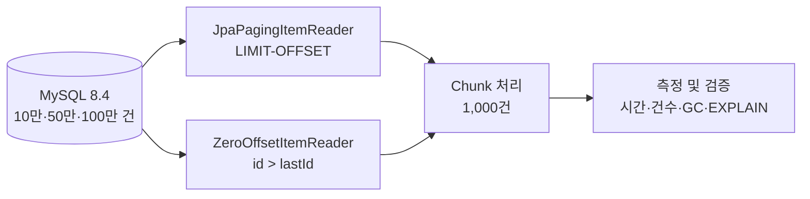

# Settlement Batch Performance

> 대량 정산 배치에서 `LIMIT-OFFSET`은 왜 느려질까?  
> Spring Data JPA만으로 Zero Offset Reader를 직접 구현하고, 10만·50만·100만 건에서 그 차이를 검증합니다.

## 프로젝트 한눈에 보기

대량 데이터를 페이지 단위로 읽는 `JpaPagingItemReader`는 뒤 페이지로 갈수록 큰 OFFSET을 사용합니다. DB는 앞선 행을 탐색한 후 버려야 하므로 데이터가 많아질수록 조회 비용이 증가할 수 있습니다.

이 프로젝트는 외부 Zero Offset 라이브러리에 의존하지 않고 다음 쿼리를 사용하는 Reader를 직접 구현하여 기존 방식과 비교합니다.

```sql
SELECT *
FROM settlement
WHERE id > :lastId
ORDER BY id ASC
LIMIT :pageSize;
```

핵심은 “Zero Offset이 빠르다”는 결론을 미리 정하는 것이 아닙니다. 동일한 데이터·조회 조건·실행 환경에서 반복 측정하고, 정합성·실행 계획·메모리 사용량까지 함께 확인하는 것이 목표입니다.

## 문제 정의

일반적인 Offset Pagination은 구현이 단순하지만 페이지가 뒤로 갈수록 다음과 같은 비용이 발생합니다.

```sql
SELECT *
FROM settlement
ORDER BY id ASC
LIMIT 1000 OFFSET 500000;
```

MySQL은 OFFSET 이전의 행을 결과에서 제외하더라도 조회 과정에서는 탐색해야 합니다. 반면 Zero Offset, 즉 Keyset Pagination은 마지막으로 읽은 PK를 다음 조회 시작점으로 사용합니다.

```text
OFFSET 방식
페이지 번호 → 앞선 행 탐색 → OFFSET만큼 버림 → 1,000건 반환

Zero Offset 방식
마지막 ID → PK 인덱스에서 시작점 탐색 → 다음 1,000건 반환
```

## 기술적 선택

| 대안 | 장점 | 단점 | 판단 |
| --- | --- | --- | --- |
| `JpaPagingItemReader` | Spring Batch 기본 제공, 구현이 단순함 | 큰 OFFSET에서 비용 증가 가능 | 비교 기준으로 사용 |
| 직접 구현한 Zero Offset Reader | OFFSET 제거, JPA 학습 범위 안에서 구현 가능 | 상태와 재시작 지점을 직접 관리해야 함 | 핵심 구현 |
| `JdbcCursorItemReader` | Native SQL과 스트리밍 활용 가능 | JPA 기반 비교라는 학습 목표에서 벗어남 | MVP 제외 |
| `JpaCursorItemReader` | 설정이 간단함 | 메모리 특성을 별도로 검증해야 함 | 선택 실험 |
| QueryDSL/외부 Reader | 편리하고 타입 안전함 | 핵심 원리를 라이브러리가 감춤 | 사용하지 않음 |

Zero Offset Reader는 다음 불변 조건을 지키도록 설계합니다.

- 유일하고 불변인 증가 PK `id`를 정렬 기준으로 사용
- `WHERE id > :lastId ORDER BY id ASC` 보장
- 정상 처리한 페이지의 마지막 ID만 다음 시작점으로 갱신
- 재시작 시 `ExecutionContext`에서 `lastId` 복원
- 전체 처리 건수와 ID를 검증하여 누락·중복 방지

## 전체 구조



Spring Batch의 처리 단위는 다음과 같습니다.

```text
Job
└── Step
    ├── ItemReader    ← 이 프로젝트의 핵심 비교 대상
    ├── ItemProcessor
    └── ItemWriter
         └── 1,000건마다 commit
```

## 실험 설계

### 통제 조건

| 항목 | 기본값 |
| --- | --- |
| 데이터 규모 | 100,000 / 500,000 / 1,000,000건 |
| Chunk size | 1,000 |
| Page size | 1,000 |
| Fetch size | 1,000 |
| DB | Docker MySQL 8.4 |
| 정렬 | `id ASC` |
| 반복 횟수 | 조건별 3회 이상 |
| 비교 원칙 | 동일 WHERE 조건·반환 컬럼·Writer 사용 |

각 실험은 워밍업과 측정 실행을 구분하고, 실행 순서를 기록합니다. DB 버퍼 풀·OS 캐시·JIT 등 완전히 제거하기 어려운 변수는 결과의 한계로 명시합니다.

### 측정 지표

- Job/Step 실행 시간과 Reader별 상대 비율
- `readCount`, `writeCount`, `skipCount`, `rollbackCount`
- 데이터 증가 배율 대비 실행 시간 증가 배율
- 구간별 또는 페이지별 조회 시간
- GC 횟수, 정지 시간, 최대 힙 및 Old Gen 사용량
- 보조 인덱스 ON/OFF에 따른 `EXPLAIN ANALYZE` 결과
- 입력 건수와 최종 처리 건수의 일치 여부

### 인덱스 실험 원칙

`id`가 PK라면 PK 인덱스를 제거하는 비현실적인 실험은 하지 않습니다. 기본 Zero Offset 실험은 PK 인덱스가 있는 상태에서 수행하고, 인덱스 ON/OFF 비교는 실제 조회 조건에 사용되는 `status`, `merchant_id`, `settled_at` 등의 보조·복합 인덱스를 대상으로 합니다.

## 성능 결과

> 아직 구현 및 측정 전입니다. 측정하지 않은 수치나 예상 향상률을 결과로 작성하지 않습니다.

구현 후 원본 로그와 함께 아래 표를 갱신합니다.

| 데이터 건수 | Reader | 1회차 | 2회차 | 3회차 | 평균 | 상대 비율 |
| ---: | --- | ---: | ---: | ---: | ---: | ---: |
| 100,000 | JpaPaging | - | - | - | - | 기준 |
| 100,000 | Zero Offset | - | - | - | - | - |
| 500,000 | JpaPaging | - | - | - | - | 기준 |
| 500,000 | Zero Offset | - | - | - | - | - |
| 1,000,000 | JpaPaging | - | - | - | - | 기준 |
| 1,000,000 | Zero Offset | - | - | - | - | - |

결과가 가설과 다르더라도 제외하거나 수정하지 않고 실행 계획, 쿼리 시간, Writer 병목, 캐시 영향을 기준으로 원인을 분석합니다.

## 기술 스택

- Java 21
- Spring Boot 4.1.0
- Spring Batch 6
- Spring Data JPA / Hibernate
- MySQL 8.4
- Gradle
- JUnit
- Docker Compose

## 실행 방법

### 준비 사항

- Java 21
- Docker 및 Docker Compose

### 1. MySQL 실행

```bash
docker compose up -d --wait
```

프로젝트 전용 MySQL은 기존 로컬 MySQL과의 충돌을 피하기 위해 `localhost:3307`을 사용합니다.

| 항목 | 기본값 |
| --- | --- |
| Host | `localhost` |
| Port | `3307` |
| Database | `settlement_batch` |
| Username | `settlement` |
| Password | `settlement` |

기본 계정은 로컬 개발 전용입니다. 외부 DB를 사용할 때는 저장소에 인증 정보를 기록하지 않고 다음 환경변수를 설정합니다.

```bash
export SETTLEMENT_DB_URL='jdbc:mysql://localhost:3307/settlement_batch'
export SETTLEMENT_DB_USERNAME='settlement'
export SETTLEMENT_DB_PASSWORD='settlement'
```

### 2. 테스트

```bash
./gradlew test
```

### 3. 애플리케이션 실행

```bash
./gradlew bootRun
```

현재는 등록된 Job이 없어 애플리케이션이 초기화된 후 정상 종료됩니다. Reader와 Job 구현이 추가되면 지정된 배치를 실행하고 종료합니다. 웹 서버를 사용하지 않는 배치 전용 애플리케이션이므로 8080 포트를 점유하지 않습니다.

### 4. MySQL 종료

```bash
docker compose down
```

데이터 볼륨까지 제거하면 생성한 실험 데이터도 삭제되므로 필요한 경우에만 `docker compose down -v`를 사용합니다.

## 테스트 전략

정합성을 확인하지 않은 성능 개선은 완료로 보지 않습니다.

- 빈 테이블에서 정상 종료
- Page size보다 적거나 정확히 같은 데이터 처리
- 여러 페이지에 걸친 전체 조회
- ID 결번이 있어도 누락 없이 조회
- 모든 ID가 정확히 한 번만 처리되는지 검증
- 두 Reader의 최종 처리 건수 비교
- 실패 후 재시작 시 누락·중복 검증
- 작은 데이터셋의 자동 테스트와 대용량 성능 실험 분리

## 구현 로드맵

- [x] Java 21·Spring Batch·JPA 프로젝트 구성
- [x] 프로젝트 전용 Docker MySQL 구성
- [x] MySQL 기반 애플리케이션 컨텍스트 테스트
- [x] 배치 전용 non-web 실행 환경 구성
- [ ] 정산 도메인 및 스키마 설계
- [ ] 10만·50만·100만 건 데이터 생성 스크립트
- [ ] `JpaPagingItemReader` Job 구현
- [ ] JPA 기반 `ZeroOffsetItemReader` 직접 구현
- [ ] 누락·중복·재시작 테스트
- [ ] 3회 반복 성능 측정 및 결과 시각화
- [ ] 보조 인덱스 ON/OFF와 실행 계획 비교
- [ ] GC 로그 및 힙 사용량 분석

## 포트폴리오에서 보여주려는 것

이 프로젝트는 단순히 “더 빠른 Reader를 만들었다”는 결과보다 다음 역량을 증명하는 데 초점을 둡니다.

- 페이징 쿼리가 DB에서 실행되는 원리를 이해하고 있는가
- 라이브러리 없이 JPQL/JPA로 Keyset Pagination을 구현할 수 있는가
- 성능과 데이터 정합성을 함께 검증하는가
- 비교 실험에서 변수를 통제하고 재현 가능한 증거를 남기는가
- 기대와 다른 결과도 설명 가능한 기술적 결론으로 전환하는가
- 구현 범위와 실험의 한계를 정직하게 구분하는가

## 프로젝트 원칙

상세한 구현·측정·AI 협업 원칙은 [AGENTS.md](./AGENTS.md)를 따릅니다.

- 원문 사례의 수치와 이 프로젝트의 실측값을 구분합니다.
- 1억 건 환경을 재현했다고 과장하지 않습니다.
- 측정하지 않은 성능 수치나 AI가 생성한 추정치를 사용하지 않습니다.
- 외부 Zero Offset 라이브러리 대신 Spring Data JPA와 JPQL/Criteria API로 직접 구현합니다.
- 결과보다 재현성, 정합성, 근거를 우선합니다.
